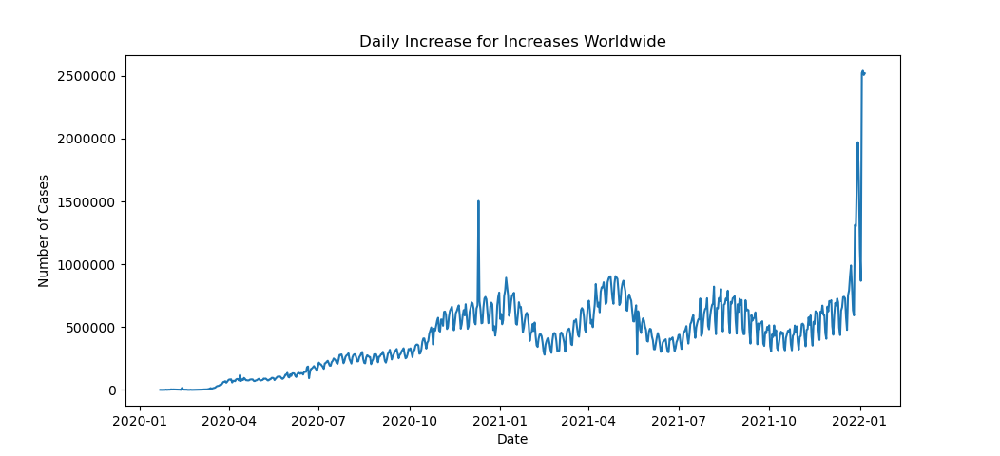
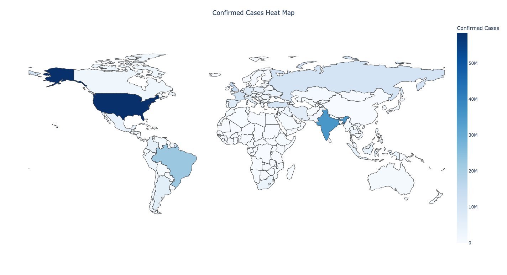

# CovidProject
This repository contains the code for the project CovidProject.

### Dataset
https://github.com/CSSEGISandData/COVID-19

2019 Novel Coronavirus COVID-19 (2019-nCoV) Data Repository by Johns Hopkins CSSE
This dataset is updated on daily basis by Johns Hopkins CSSE

This project can be split into two parts.

### Data Visualization

Confirmed/Deaths Cases globally and in U.S.;

Confirmed/Deaths Cases Heat Map Globally and in U.S.

### Prediction
Selected model: SVM

Model for predicting whether a country would have an intense
COVID outbreak in the next month.

